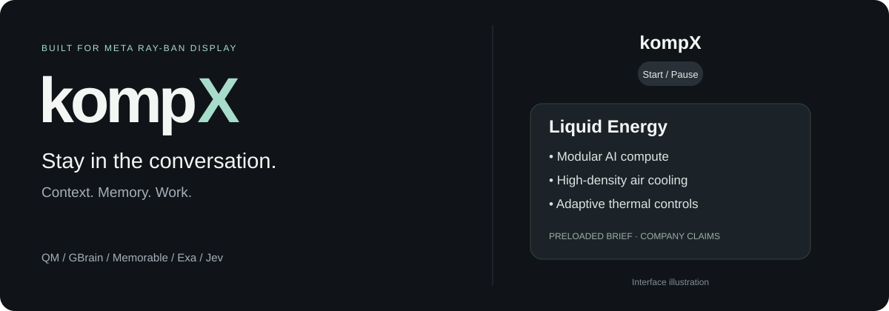
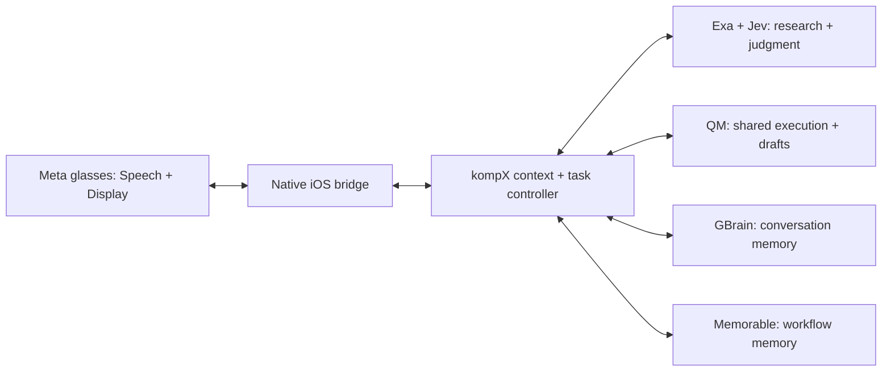

<p align="center">
  
</p>

# kompX

**Useful context, right in your glasses.**

kompX is a hackathon prototype for **Meta Ray-Ban Display**. It connects spoken context to short, sourced cards, conversation memory, and agent workflows—so you can stay with the person in front of you.

Built by [Shahdad](https://github.com/shahdadk) with **QM, GBrain, Memorable, Exa, and Jev**. The glasses are the primary interface; a native iOS app handles pairing and transport.

[Demo modes](#demo-modes) · [Run locally](#run-locally) · [Architecture](#how-it-works) · [Verification](docs/STATUS.md)

## What it does

- **Brings context into view.** Public names and companies can produce brief background cards with source details, including education, prior work, and company technology.
- **Turns conversation into work.** A supported request or shared agreement can start a document draft through QM while the conversation continues.
- **Remembers useful context.** GBrain stores conversation checkpoints with verified readback. Memorable stores and recalls reusable workflow procedures.
- **Keeps actions inspectable.** Drafts, recipients, and calendar proposals can be reviewed before an explicit send confirmation.

## Demo modes

**Ambient assistance:** select Start, speak naturally, and let the backend evaluate the conversation. A useful card can surface with a Details action for its sources. Real glasses transcription, a sourced company card, and wearer Details/Done interaction have been verified. Automatic triggering is still inconsistent across speech-recognition errors and conversational phrasing.

**Preloaded interface demo:** select the **kompX** wordmark with the wristband's Select gesture to open a local Liquid Energy brief. It is visibly labeled **Preloaded brief**, stays open until Done, and does not depend on a live lookup or start the microphone. Start/Pause remains a separate control. This is the deterministic manual path prepared for the recorded demo.

The banner above is an interface illustration. The manual demo is distinct from the ambient research path. [Native setup and hardware evidence →](docs/META-SETUP.md)

## How it works



| Integration | Its role | Implementation |
| --- | --- | --- |
| **Meta DAT** | Glasses transcription, native cards, and wristband interaction | [Native bridge](native/ios/GlanceQM) |
| **QM** | Shared execution context, structured proposals, summaries, and document preparation | [QM client](src/integrations/qm.ts) |
| **GBrain** | Self-hosted memory with scoped recall, revision-checked writes, and readback | [GBrain client](src/integrations/gbrain.ts) |
| **Memorable** | Save successful procedures and recall them for later work | [Procedural memory](src/integrations/procedural-memory.ts) |
| **Exa** | Retrieve attributed public sources for background research | [Search adapter](src/integrations/exa.ts) |
| **Jev** | Choose useful actions and validate cards against their exact context and sources | [Decision gate](src/integrations/jev.ts) · [Fast context path](src/integrations/instant-context.ts) |

The controller coalesces transcript updates, keeps source references, and rejects stale results after corrections. In Jev-native mode, a hold or invalid receipt does not authorize publication. Email and calendar sends require their own confirmation. [Architecture and API boundaries →](docs/ARCHITECTURE.md)

## Run locally

### 1. Try the credential-free demonstration

Requires **Node.js 22+** and npm. Use Node.js 24 for the full local QM stack.

```sh
git clone https://github.com/shahdadk/glance-qm.git
cd glance-qm
npm ci
npm run check
npm run demo
```

`npm run demo` exercises the controller with deterministic fixtures. It makes no live provider calls and sends no invitations or email.

### 2. Connect the live services

Configure [QM](docs/QM-SETUP.md), [GBrain](docs/GBRAIN-SETUP.md), and provider accounts using [`.env.example`](.env.example) and the [account setup guide](docs/ACCOUNT-SETUP.md). Then run:

```sh
node scripts/start-demo.mjs
```

The launcher verifies authenticated QM/GBrain access and starts the backend on **8790** and development companion on **5174**. The launcher defaults to `jev-native`; `.env.example` offers an explicit `qm` configuration. The optional accelerated path requires `GLANCE_DECISION_MODE=jev-native` and `GLANCE_INSTANT_CONTEXT=true`, with Jev and Exa configured.

Follow the [full runbook](docs/RUN-DEMO.md) for provisioning, restarting, and phone connectivity. The web companion is a development tool; the native glasses app is the wearer experience.

### 3. Pair the glasses

Build [`native/ios/GlanceQM.xcodeproj`](native/ios/GlanceQM.xcodeproj), register with Meta AI, and import the private connection file generated by the launcher. The app uses the pinned Meta DAT 1.0.0 package. Supported hardware, signing, and developer capability access are required.

[iOS build, pairing, and wristband controls →](docs/META-SETUP.md)

## Verification and current limits

- **211 TypeScript tests** passed at the latest backend revision; the build and nine-check fixture demo passed.
- **13 native tests** and the signed iPhone build passed.
- Live checks cover QM execution, Exa/Jev research, Memorable procedures, and two successive GBrain checkpoints while a session remained open.
- A sourced card reached the real glasses and the wearer opened its details. That rehearsal involved maintenance and reprocessing; it is not proof of reliable, immediate responses to every conversation.

Sustained background capture and general automatic-trigger reliability remain open. The application currently authenticates a single local operator; QM's shared project is separately verified. Gmail and Calendar have review/confirmation flows, but no real email or invitation was sent during verification. GBrain uses keyword recall; semantic embedding recall is not claimed.

[Verification overview and evidence →](docs/STATUS.md)

## Find your way around

| Directory | Contents |
| --- | --- |
| [`native/ios`](native/ios) | Swift glasses bridge and native tests |
| [`src/core`](src/core) | Context, persistence, task lifecycle, and scheduling |
| [`src/integrations`](src/integrations) | Provider adapters and evidence gates |
| [`src/server`](src/server) | Authenticated HTTP/WebSocket API and delivery routes |
| [`src/shared`](src/shared) | Validated client/server contracts |
| [`web`](web) | Development and shared-context companion |
| [`scripts`](scripts) | Service setup, launchers, and reproducible checks |
| [`test`](test) | Backend and integration contract tests |

## Development

```sh
npm run dev       # Backend + web companion
npm run check     # Both TypeScript projects + tests
npm run build     # Typecheck + production web build
npm run demo      # Deterministic end-to-end fixture
```

Keep credentials, pairing files, recordings, and transcripts in ignored local state. Tests and source builds do not require personal provider credentials. For changes, include relevant verification and distinguish fixture results from live service or hardware evidence.

This is an independent project inspired by earlier Glance design principles. See [integration attribution](docs/INTEGRATIONS.md) and the [Meta SDK notice](native/ios/NOTICE.md) for provenance and third-party terms.
